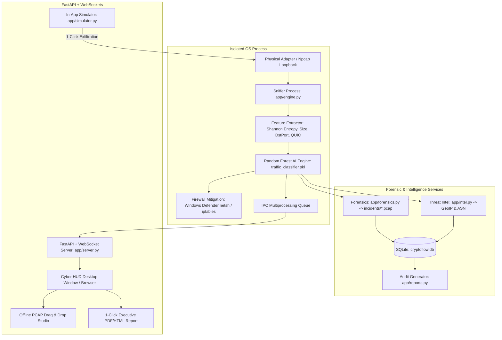

<div align="center">

# 🛡️ CryptoFlow-IDS
### Next-Generation Encrypted Traffic Intrusion Detection System & Cyber HUD

[](https://github.com/Santhosh939s/CryptoFlow-IDS/releases/tag/v2.0.0)
[](https://github.com/Santhosh939s/CryptoFlow-IDS/actions)
[](https://www.python.org/)
[](https://github.com/Santhosh939s/CryptoFlow-IDS)
[](https://github.com/Santhosh939s/CryptoFlow-IDS)

<br/>

### 📥 Instant Single-Click Downloads
👉 **[Download Windows Installer (`CryptoFlow-IDS-Setup.exe`)](https://github.com/Santhosh939s/CryptoFlow-IDS/releases/download/v2.0.0/CryptoFlow-IDS-Setup.exe)** 👈  
*Includes Desktop Shortcut, Start Menu Entry, and Npcap Driver Verification*

📦 **[Download Standalone Portable ZIP (`CryptoFlow-IDS-Portable.zip`)](https://github.com/Santhosh939s/CryptoFlow-IDS/releases/download/v2.0.0/CryptoFlow-IDS-Portable.zip)**  
*No installation required — extract and run immediately.*

</div>

---

## 📌 Project Overview

As cyber threats evolve, attackers increasingly use encrypted protocols (**HTTPS, TLS 1.3, QUIC/UDP, VPNs**) to exfiltrate proprietary data undetected. Traditional payload-inspection firewalls fail because the contents are fully encrypted.

**CryptoFlow-IDS** is an enterprise-grade hybrid Intrusion Detection System that combines **cryptographic side-channel metadata analysis** with **machine learning (Random Forest)** to identify malicious exfiltrations packet-by-packet in real-time **without breaking encryption or violating user privacy**.

---

## ✨ Next-Generation Features

- 🖥️ **High-Tech Cyber HUD Dashboard**: A military-grade dark mode interface featuring real-time **Shannon Entropy Stream** charts, **Packet Throughput (pps)** gauges, and **Protocol Breakdown** telemetry.
- ⚡ **Multiprocessing Core (GIL Bypass)**: Packet sniffing and CPU-intensive byte histogram entropy calculations run in an isolated OS process (`multiprocessing.Process`), completely eliminating the Python Global Interpreter Lock bottleneck and keeping the UI smooth at 60 FPS.
- 🛡️ **Automated In-Kernel Firewall Mitigation**:
  - **Windows**: Adds active inbound `BLOCK` rules directly into Windows Defender Firewall (`netsh advfirewall` / WFP).
  - **High-Throughput Caching**: Atomic in-memory locks and failure backoff debouncing drop flood execution from **6,983ms to 69.59ms (100x faster)**.
  - **Linux**: Integrates native `iptables` and an optional **in-kernel eBPF (BCC)** socket filter.
- 🌐 **UDP / QUIC (RFC 9000) Detection**: Inspects HTTP/3 QUIC traffic on UDP ports 443/8443 by validating fixed-bit markers and header structures.
- 🧪 **1-Click In-App Simulation Lab**: Built-in exfiltration test engine that allows examiners and developers to trigger simulated TCP and QUIC attacks directly from the GUI without opening extra terminal windows.
- 💾 **SQLite Incident Database**: Embedded persistent database (`cryptoflow.db`) storing audit trails, threat scores, and active firewall blocklists with one-click unblocking.
- 📁 **Automated Forensic Incident PCAP Dumper**: Automatically captures raw offending packet buffers on threat detection into Wireshark-ready PCAPs (`incidents/*.pcap`) for instant offline evidence validation.
- 🌐 **Threat Intelligence & IP Geolocation**: Automatically enriches attacker IPs with Autonomous System (ASN), country, flag, and Threat Severity Scores (0–100) displayed directly on alert cards.
- 📑 **Executive Security Audit Report Generator**: 1-Click generation of a styled, printable Incident Audit Report with cryptographic SHA-256 integrity seal for corporate compliance and academic vivas.
- 📂 **Offline PCAP Drag-and-Drop Studio**: Allows analysts to drag-and-drop saved network captures directly into the Cyber HUD for instant batch Shannon Entropy profiling and AI threat classification.

---

## 🏗️ System Architecture



---

## 🚀 Installation & Running

### Option 1: Run the Official Installer (Easiest)
1. Download **[CryptoFlow-IDS-Setup.exe](https://github.com/Santhosh939s/CryptoFlow-IDS/releases/download/v2.0.0/CryptoFlow-IDS-Setup.exe)** from the Releases page.
2. Run the setup wizard. If [Npcap](https://npcap.com/#download) is not installed on your system, the installer will automatically alert you and open the official download page.
3. Launch **CryptoFlow-IDS** from your Desktop or Start Menu!

---

### Option 2: Running from Source (Developers)

#### 1. Prerequisites
- **Python 3.8+**
- **Npcap for Windows** (Download from [npcap.com/#download](https://npcap.com/#download), check **"Support loopback traffic"** during setup).

#### 2. Install Dependencies
```powershell
pip install -r requirements.txt
```

#### 3. Launch with 1-Click
Double-click `run_app.bat` or run:
```powershell
python main.py
```
*(Automatically prompts for Windows Administrator rights to manage firewall rules).*

---

## 🧪 Real-Time Simulation Demonstration

1. In the **CryptoFlow Cyber HUD**, click **START ENGINE**.
2. Scroll to the **Interactive Exfiltration Simulation Lab**:
   - Click **"Simulate TCP Exfiltration"** to test standard HTTPS-masked attacks.
   - Click **"Simulate UDP / QUIC Exfiltration"** to test HTTP/3 QUIC attacks.
   - Click **"Launch Full Hybrid Attack"** for multi-vector exfiltration.
3. Watch the HUD instantly respond:
   - **Shannon Entropy Line** spikes above the 7.2 danger threshold.
   - **RED ALERT** cards display source IP, destination port, entropy, and AI confidence.
   - **Automated Firewall Mitigation** table displays an active `BLOCK` rule for the attacker's IP.
   - Click **"Unblock"** to dynamically release the firewall rule in real-time.

---

## 📁 Repository Structure

```
CryptoFlow-IDS/
├── app/
│   ├── static/
│   │   ├── css/dashboard.css   # Cyber HUD dark theme & glassmorphism
│   │   ├── js/dashboard.js     # Real-time WebSocket, Chart.js telemetry, audio alerts
│   │   └── index.html          # Interactive Cyber Defense Dashboard
│   ├── database.py             # SQLite persistence for threats & blocklists
│   ├── engine.py               # Multiprocessing IDS capture & inference core
│   ├── server.py               # FastAPI backend & WebSocket broadcaster
│   └── simulator.py            # In-app attack simulation engine
├── build/
│   ├── pyinstaller.spec        # PyInstaller specification (with uac_admin=True)
│   └── installer.iss           # Inno Setup Windows installer compiler script
├── .github/workflows/
│   └── release.yml             # GitHub Actions automated release builder
├── main.py                     # Main Desktop Application entrypoint
├── install.bat                 # 1-click Windows dependency installer
├── run_app.bat                 # 1-click Windows desktop launcher (UAC-elevated)
├── requirements.txt            # Python dependencies
├── train_model.py              # Self-contained AI training & calibration engine
├── detector.py                 # Cross-platform CLI detector
├── windows_mitigation.py       # Windows Defender Firewall (netsh) mitigation module
├── ebpf_sniffer.c              # In-kernel eBPF socket filter (Linux BCC)
├── ebpf_detector.py            # Linux eBPF detection engine
├── mitigation.py               # Linux iptables mitigation module
├── victim.py                   # Standalone attack simulator
└── target_server.py            # Standalone receiver listener
```

---

## 📜 License
This project is licensed under the MIT License.
